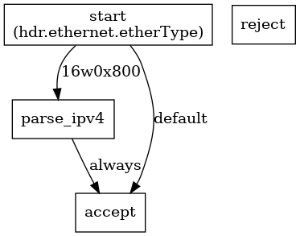

# p4c-graphs usage

展示使用 p4c-graphs 來編譯 p4 program 並產生 dot file，並輸出成 png, pdf 的演示

---

## 編譯 l3_forward.p4

> running `make` command with p4c dependencies.

Components | Graphs 
:-: | :-: 
Basic_parser | 
Basic_ingress | 
Basic_deparser | 

---

# Reference

* [p4lang/p4c - graphs](https://github.com/p4lang/p4c/blob/master/backends/graphs/README.md)
