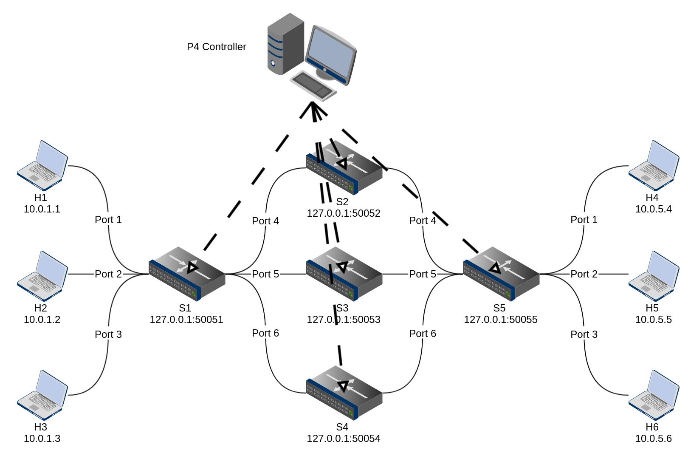

# advance

製作簡易的 controller 為目的，搭配原有 p4lang/tutorials 提供的 p4 + mininet 相關程式碼來做練習。

## Scenario

* Topology
    * 透過 `topology.json` 來定義網路拓樸的模樣
    * 採用較大型的網路架構
* P4 program
    * 使用基本的 l3_forwarding 的 P4 程式碼，額外加上 tcp/udp 支援
    * 並在封包完成 `ipv4_forward`、`tcp/udp_forward` 後對不同 counter 來做累加
* Controller
    * 使用根目錄下 utils/ 提供的 p4 + mininet 程式來製作
    * 提供基本的幾個動作，於本專案提供：
        * 寫入簡單規則: 取代 `basic/` 內原本給 switch 讀取的 sx-runtime.json，改由 controller 做派送。
        * 使用簡單的 counter 操作，了解 counter 當中 counter name 與 index 間關係、以及 counter 的簡單使用方法。
        * 在 controller 端做判斷，當 counter 數量超過某一個定值，則導到另一條 path
---

## Run 

* Step 1: `./build.sh` 啟動 mininet 環境
   * 載入編寫的 p4 program (.json) 以及依據拓樸 (topology.json) 來建制 mininet 
* Step 2: `make controller` 來啟動 controller
   * 開啟 controller 後，會幫每台 switch 載入 forwarding rules 
   * 這麼一來連線功能就完成了
* Step 3: 再看到 `./build.sh` 所建立的 mininet CLI
   * 當中可以透過 xterm h<x> 的方式開啟任意的 host 來做 tcp/udp 測試
   * 可以透過 `../../utils/pktgen/` 內提供的簡易程式來做到 tcp/udp 封包測試
        * 傳送端: `python ../../utils/pktgen/sender.py --ip <target_host_ip> --msg <"Something u want to say">`
        * 接收端: `python ../../utils/pktgen/receiver.py`

   
## 說明

* 一開始運行的 flow rule 是：
    * `h1` -> `s1` -> `s2` -> `s5` -> `h4,h5,h6`
    * `h2` -> `s1` -> `s3` -> `s5` -> `h4,h5,h6`
    * `h3` -> `s1` -> `s4` -> `s5` -> `h4,h5,h6`

* 透過 P4 Counter 的支援，我們在 `advance.p4` 當中設置了一個 Counter，並以 0 做為該 counter 的 index，用來標記通過該 device 上的所有封包計數（型態為 `packets_and_bytes`）
* 此時我們可以增加修改原本 forwarding rules 的條件：
    * 在這邊我設定： `當 s2 上面的 counter > 50 時，我們修改 s1,s3 與 s5 的規則`，讓原本 `h1,h4 之間的流量`從 s1 <-> s2 <-> s5 改成 s1 <-> s3 <-> s5，並可以透過運行中的 controller 來察看各個 switch 上面封包數量的變化，藉此得知 modify 的功能有出現
