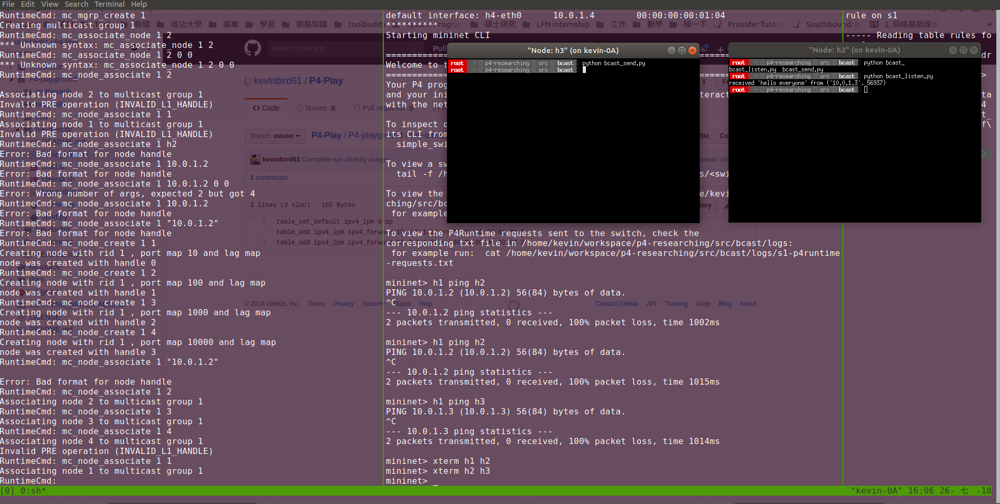

# Broadcast 

展示在 bmv2 上頭使用 broadcast/multicast 功能

## Scenario

* Topology 
    * 採用上圖所示的網路拓樸
* P4 program
    * 一般 switch 使用 l3_forwarding 的程式
* Controller 
    * 與大部份的設置相同，不過因為 switch 不同的緣故，所以我們必須修改部份 controller 程式來使用

---

## Run

* Step 1: `./build.sh` 啟動編譯、並開啟 mininet 環境
    * 使用 P4 程式以及依據拓樸來建置
* Step 2: `make controller` 來啟動 controller
    * 開啟 controller 後，會幫 NAT 以及一般的 switch 做上頭規則的填入
* Step 3: 透過 `simple_switch_CLI --thrift-port 9090` 來啟動 target switch 的 CLI 操作介面
    * 需要做到 - 建立 multicast group, 建立 node, 建立 group 與 node 的關係，以下的操作皆位在 CLI 操作介面底下執行！
    * 建立 multicast group: 
        * `RuntimeCmd: mc_mgrp_create <group_id>`
    * 建立 node: 
        * `RuntimeCmd: mc_node_create <mc_node_id> <ports>`
        * 這邊的 mc_node_id 可以隨便取，ports 則是該 switch 上頭目前配置連接的 port 碼（P4 Host 與 switch 連接時的那個 port number）
        * 而這指令下達完成後，會回傳一組 handler number（一樣是數字），**而這個數字即是 node 的 handler id**，下一個指令會用到
    * 建立 group 與 node 關係
        * `RuntimeCmd: mc_node_associate <group_id> <node_handler_id>` 
        * 這邊便是連接 ports 與 group id 的關係！ 下達指令完成後即可看到成功的顯示訊息
        > 注意！
        > simple_switch_grpc 是 thrift + grpc(P4Runtime) 並用！
        > 所以在這邊可以用 `simple_switch_CLI` 來對現有已啟動 switch 連線!
    * 這邊的操作可以參考目錄下的 `cli.txt`, 呼叫: `simple_switch_CLI < cli.txt` 即可完成 

* Step 4: 完成配置，可以進行 broadcast 的測試囉！
    * 在 `./build.sh` 開啟的 mininet CLI 當中以 `xterm` 啟動 `h1, h2, h3, h4`
    * 選擇其中一個作為送出 broadcast 的使用者，在該 xterm 的視窗當中輸入 `python bcast_send.py`（注意，要等其他 host 開啟 listen 程式才有意義！）; 其餘的 host 可以開啟 `python bcast_listen.py` 來等 switch 送出的 boardcast 封包; 成功後可以如下方圖示，看到所有的 listener 都接收到從 h1 上送出的封包

---

## 說明

* host 端上頭直接送出 dst IP = 255.255.255.255 的封包，在 switch 上頭則有相對應的 match-action 機制，當 match 時便會標示為廣播/多播的方式來做傳輸
