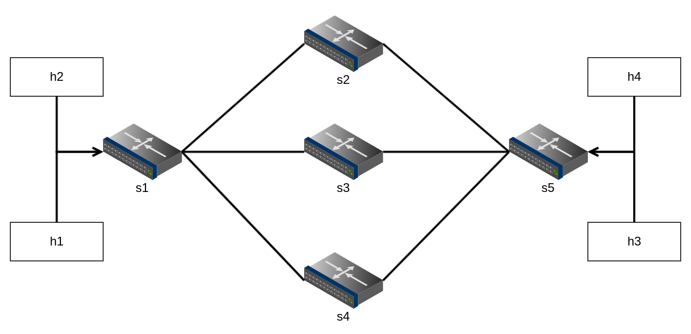
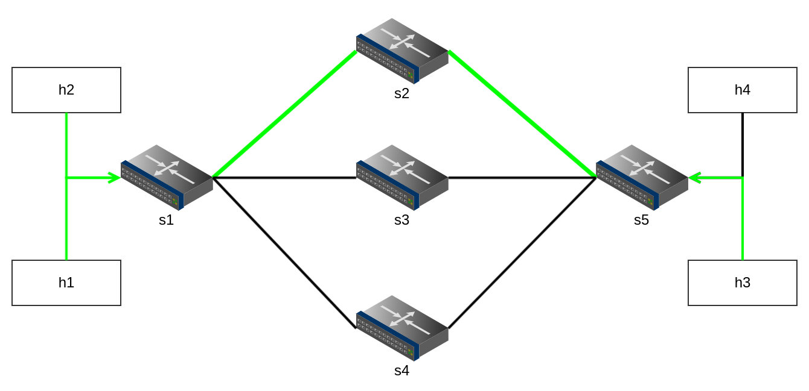
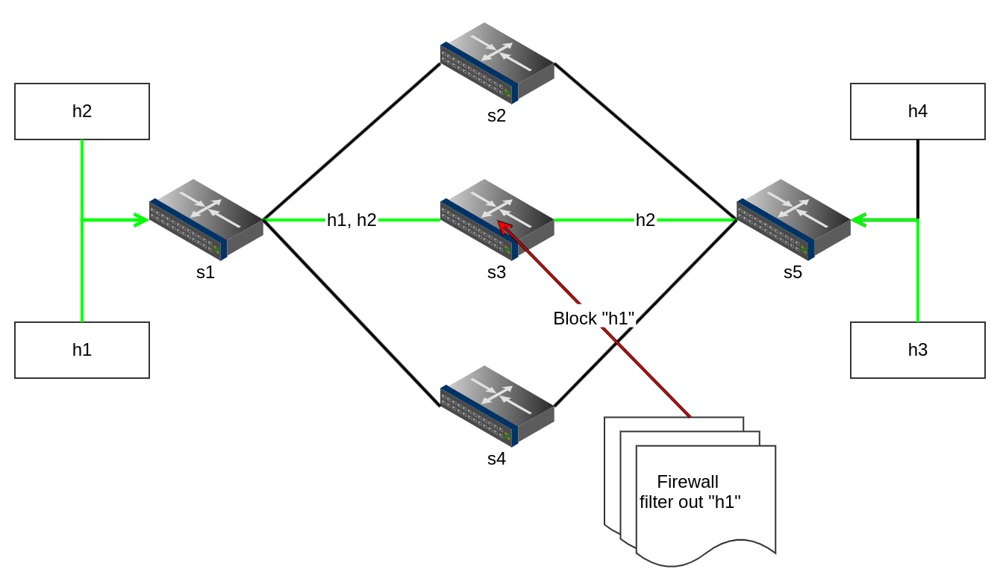
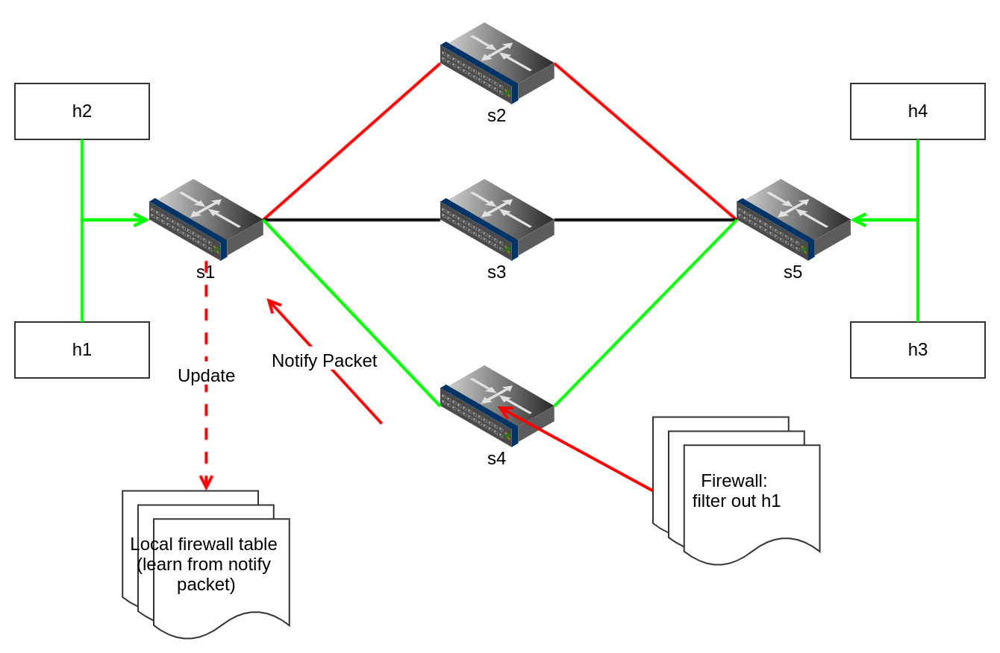

# Shallow Packet Inspection

簡單透過本專案使用的測試環境 - bmv2 以及 Python 腳本編寫的 sender/receiver 程式，來實作 P4 本身提供的特性 - Packet Inspection （有別於以往的 DPI: Deep Packet Inspection，故使用 Shallow 字眼做區隔）。

目前的版本還是依據簡單的 firewall 功能來做展示（未來會再加上 "針對特定 pattern" 做比對過慮）。

## Demo 

列舉了幾項情境操作 - `normal`, `protected`, `beacon`。並使用了三條 parallel path 分別搭載不同的情境做展示。 

* 拓樸展示：

### Normal

這個版本單純是裝上一個能夠 forwarding 的情境（with no any firewall, or other NF on it）。操作：
* `./build.sh` 建立整個 topology
* 透過 tmux 或是另一個視窗，呼叫 `./normal.sh` 來對本情境中的 switch 來安裝對應的 forwarding rules.

### Protected

這個情境是基本的 firewall 功能，以我的範例來說，是在 s3 上安裝我們的 firewall rules。並且設定 source h1, h2 與 destination h3 必須經過 `s3`。而 firewall 我設定是過慮掉 h1 的流量，e.g 只要 src IP address 為 h1 的，變認定為 malformed packets。

運行後可以發現 h1 的流量便沒辦法到達 h3。

* `./build.sh`
* `./protected.sh`

### Beacon

取名來自 "烽火台" 的意思，這個 demo 主要展示以 protected 為底，這次 firewall rules 放在 s4 上，並且主要流量設定必須流經過 s1 <-> s4 <-> s5 。 安插一條過慮掉 h1 的 firewall rules 放在 s4 上 。 

為了測試這個利用 register 來實作的 local firewall table，我額外用了 h4 來展示，讓 h1 與 h4 的流量透過 s1 <-> `s2` <-> s5 來做傳輸，並確認兩條 overlap 的地方是在 aggregated switch 上。 而這個 local firewall table 便是每台 sw 上都會配備的，只要看到 notify packet，便會對自己的 local table 來做更新。

而 scenario 便是設定讓我們的 s4 在偵測到 filter h1 的 firewall rule 被觸發時，轉發 **Notify packet** 到送來的那個來源 sw（若使用 multicast，則能夠送到上家跟下家）。而 s1 收到這份 Notify packet 後，便會對上面的 local table 做更新。 注意，這個觸發條件是 s4 必須看到 h1 的流量，才會轉發 Notify packet。 所以測試時必須先 `h1 ping h3`，讓 s4 觸發後，再測試 `h1 ping h4` 來察看，是否 `s1` 從 Notify packet 當中獲取資料、並更新其上頭的 local firewall table。（因為到 h3,h4 的路徑不同，唯有讓 s1 學習才能夠擋住 h1 往 h4 的流量！）

* `./build.sh`
* `./beacon.sh`

