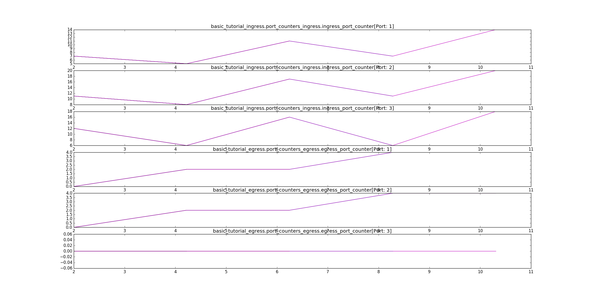

# Monitor

相比於直接印出 counter (bytes 及 packets 的數量)、這個 demo 主要嘗試使用 matplotlib 來繪製 switch 當中所 maintain 的 counter 數值。

## Example

* 以 `s1` 上的使用為例（在運行 `./build` 後使用 `h1 ping h2` 指令後，開啟另外一個視窗呼叫 `./monitor.sh` 啟動程式提供的 matplotlib 腳本來繪製圖片，目前預設是 10 秒後做 timeout，並繪製圖片 ）： 
