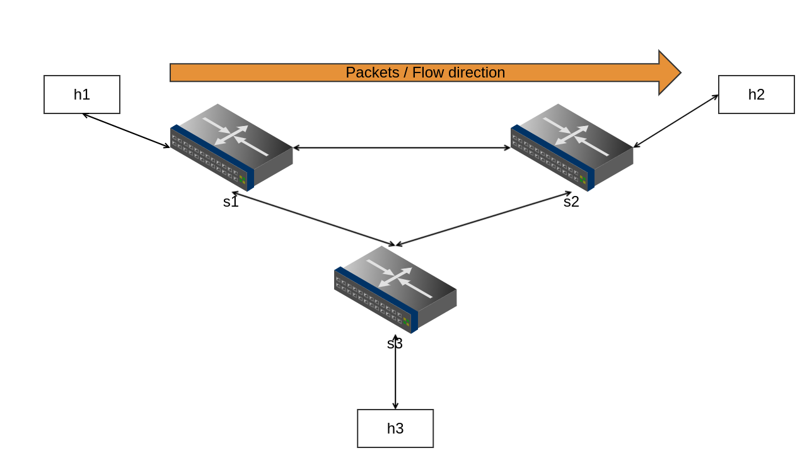

# Basic Forwarding

展示基本的 P4-based forwarding 功能，以簡單的3個 switch-host 的 scenario 做 demo。

## 運行

* 在本資料夾下運行 `./build.sh`，程式會編譯 l3_forward.p4，並呼叫 python scripts 來建立 network topology，將 sX-runtime.json 作為 pre-installed rules 安裝於啟動的 software switch 上。
* 啟動成功後，會進入到 mininet CLI 當中，可以直接呼叫 `h1 ping h2` 來檢視、察看是否能通。