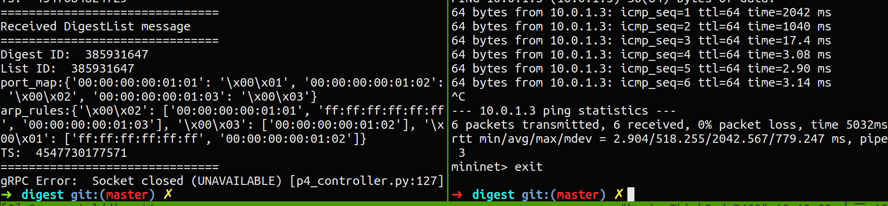

# Digest - Learning switch 

展示如何使用 digest 功能來實作 L2 learning switch。（可以拿來跟使用 PacketIn/Out 來實作的版本做對應）

* 展示 digest 的功能於 python 版本的 p4runtime library 當中
* 展示 digest 的特性 - 不需要將整個封包都傳給 controller 來做分析，直接抽取需要的欄位即可。
* 執行示意圖（左側 tmux 視窗執行： `./start_p4_controller.sh`、右側 tmux 視窗執行： `./build.sh` 並在 mininet CLI 中執行 `h1 ping h2`）:
 