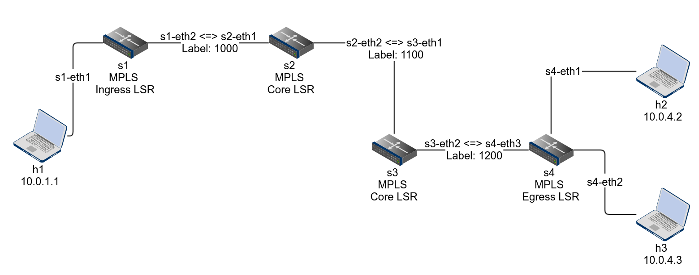

# MPLS

以 P4 來摹擬 MPLS 運作流程。

## Scenario

* Topology
    * 透過 `topology.json` 來定義網路拓樸的模樣
* P4 program
    * 使用基本的 mpls.p4 的 P4 程式碼
    * 實作 MPLS 的機制，包含：
        * Ingress LSR (`Label Switch Router`)
        * Core LSR 
        * Egress LSR 
* Controller
    * 使用根目錄下 utils/ 提供的 p4 + mininet 程式來製作
    * 提供基本的幾個動作，於本專案提供:
        * 放入 MPLS 的 Label
        * 於 Core LSR 當中做 Label 的切換
        * 並在 Egress LSR 時拿掉 

---

## Run 

* Step 1: `./build.sh` 啟動 mininet 環境
   * 載入編寫的 p4 program (.json) 以及依據拓樸 (topology.json) 來建制 mininet 
* Step 2: `make controller` 來啟動 controller
   * 開啟 controller 後，會幫每台 switch 載入 forwarding rules 
* Step 3: 回到 Step 1 開啟的 mininet CLI
   * 輸入 `h1 ping h2` 或是 `h2 ping h1` 來察看是否有通

---

## 說明

MPLS 機制能夠減少 switch 去 parse IPv4 address 的時間，直接在 MPLS 這層來做 forwarding 的動作，這個範例程式即是以這個方向去做實現