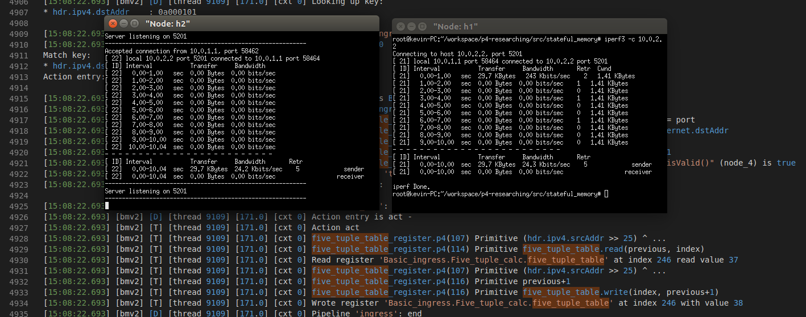

# Table array

使用 P4 當中 v1model.p4 提供的 register 功能實作 array，並使用 5-tuple 的概念實作 table 的 key, 並在每次 packet 經過時去對其 5-tuple 所計算出的 key 對應的 value 做累加。

## Run 

* Step 1: `./build.sh` 啟動 mininet 環境
   * 載入編寫的 p4 program (.json) 以及依據拓樸 (topology.json) 來建制 mininet 
* Step 2: `make controller` 來啟動 controller
   * 開啟 controller 後，會幫每台 switch 載入 forwarding rules 
   * 這麼一來連線功能就完成了

## 觀察

* 進入 mininet CLI 後，透過 `xterm h1 h2` 開啟 h1, h2 的 terminal
* 在 h2 開始，開啟 server: `iperf3 -s` 
* 隨後到 h1 開啟 client: `iperf3 -c 10.0.2.2` 來建立 tcp (或是加上 `-u` 建立 udp 連線) 
    * 由於 5-tuple 會用到 source port, destination port 所以需要用到 tcp/udp 的連線 (不能用原本的 `ping` 來做)

結果：

* 可以看 s1 log 當中，出現 register 寫入的動作： 

* 透過 `simple_switch_CLI` 連線到 `s1` 上，透過 `RuntimeCmd` 來輸入 `register_read` 加上對應的 register 以及 `index` 來印出對應的值！
